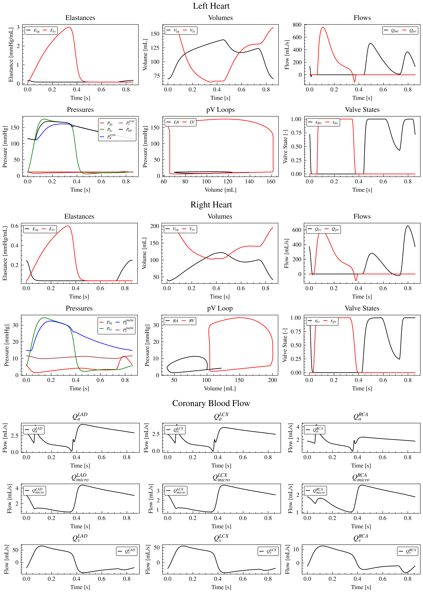

# Mathematical-modelling-of-global-cardiac-energetics-in-aortic-stenosis

Python research code showcase accompanying my bachelor's thesis at Brno University of Technology. The project explores how aortic stenosis and changes in cardiovascular parameters affect haemodynamics, coronary blood flow and the balance between myocardial energy supply and demand.

**Thesis:** [Mathematical modelling of global cardiac energetics in aortic stenosis](https://www.vut.cz/en/students/final-thesis/detail/175708)

**Author:** Martin Dvouletý 

This repository brings together the cardiovascular model, simulation scripts, sensitivity analyses and figures. It serves as a code showcase and a record of the computational work behind the thesis.

## Model and analyses

The model represents the four cardiac chambers, cardiac valves, systemic and pulmonary circulation, and three coronary territories: LAD, LCX and RCA. The implementation includes:

- Numerical integration of the model equations with SciPy, with a Numba-compiled ODE function.
- Repeated cardiac cycles and a check for convergence towards a periodic state.
- Pressure-volume loops and estimates of cardiac work, oxygen demand and energy supply.
- Single-variable analysis and global sensitivity analysis using Morris and Sobol methods.
- Virtual populations generated by Latin hypercube sampling, with and without aortic stenosis.
- Parallel evaluation of population simulations and subsequent statistical analysis.
  
- Computational resources were provided by the e-INFRA CZ project (ID:90254), supported by the Ministry of Education, Youth and Sports of the Czech Republic.

| File or directory | Purpose |
| --- | --- |
| `equations.py` | Activation functions and cardiovascular differential equations |
| `cycles.py` | Integration of individual cardiac cycles, derived quantities and repeated-cycle simulation |
| `input_values/parameters_input.json` | Baseline model parameters and initial conditions |
| `plot_functions.py` | Plotting utilities for model outputs and analyses |
| `Model_output/output.ipynb` | Model output examples for AS and noAS |
| `Model_output/pVloops.ipynb` | Pressure-volume loop analyses |
| `Single_Variable_Analysis/` | Parameter sweeps, their results and figures |
| `Global_Sensitivity_Analysis/Morris/` | Morris sensitivity analysis |
| `Global_Sensitivity_Analysis/Sobol/` | Sobol sensitivity analysis |
| `Simulation/` | Virtual-population generation, simulations and analysis |

For a first look, browse the example figures in `Model_output/output.ipynb`. Some notebooks contain large saved outputs; if GitHub cannot display them, open them locally.



## Installation

Use a Python 3.12 virtual environment as a starting point. The accompanying `requirements.txt` lists identified dependencies.
Clone the repository without automatically downloading the large Git LFS datasets:

macOS, Linux:
```bash
GIT_LFS_SKIP_SMUDGE=1 git clone https://github.com/DvouMa02/Mathematical-modelling-of-global-cardiac-energetics-in-aortic-stenosis.git
cd Mathematical-modelling-of-global-cardiac-energetics-in-aortic-stenosis
python3.12 -m venv .venv
source .venv/bin/activate
python -m pip install --upgrade pip
python -m pip install -r requirements.txt
```

Windows:
```powershell
$env:GIT_LFS_SKIP_SMUDGE = "1"
git clone https://github.com/DvouMa02/Mathematical-modelling-of-global-cardiac-energetics-in-aortic-stenosis.git
Remove-Item Env:GIT_LFS_SKIP_SMUDGE
cd Mathematical-modelling-of-global-cardiac-energetics-in-aortic-stenosis
py -3.12 -m venv .venv
.\.venv\Scripts\Activate.ps1
python -m pip install --upgrade pip
python -m pip install -r requirements.txt
```

The baseline model example below uses the supplied JSON parameters and does not require the large CSV datasets.

## Model example

From the repository root, save the following code as `demo.py` and run `python demo.py` in the activated environment:

```python
import json
from pathlib import Path

import matplotlib.pyplot as plt

from cycles import multiple_cycles

root = Path(__file__).resolve().parent
with (root / "input_values" / "parameters_input.json").open() as f:
    parameters = json.load(f)

result, cycles_run = multiple_cycles(
    parameters,
    number_of_cycles=100,
    check_stability=True,
    store_all=False,
)

print(f"Completed {cycles_run} cardiac cycles.")

fig, ax = plt.subplots()
ax.plot(result["chambers"]["Vlv"], result["chambers"]["Plv"])
ax.set_xlabel("Left ventricular volume (mL)")
ax.set_ylabel("Left ventricular pressure (mmHg)")
ax.set_title(f"left ventricular pV loop")
fig.tight_layout()
plt.show()
```

The first call may take longer because Numba compiles the ODE function.


## License

The code is distributed under the [MIT License](LICENSE).
